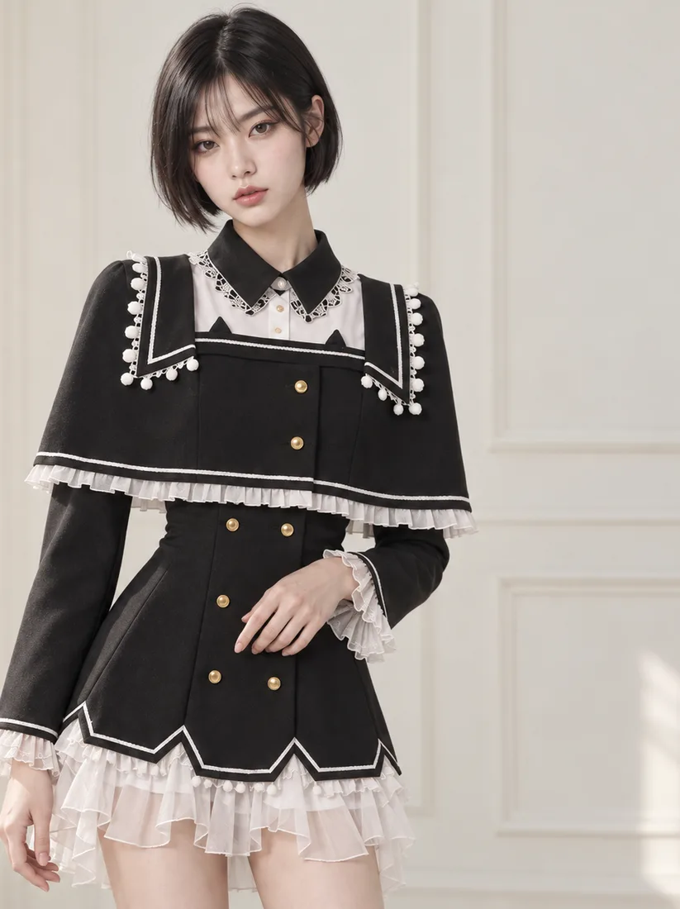

# About 페이지 스크롤 서사형 개편 — 작업 지시서

> 이 문서는 `eco-archive-gpu` 저장소의 `about.html`을 스크롤 기반 서사 페이지로 개편하는 작업의 전체 명세다. 저장소를 처음 보는 사람이 이 문서만으로 작업할 수 있도록 필요한 기존 코드와 제약을 모두 포함했다.

---

## 0. 작업 전 필독 — 저장소 기본 규칙

**기술 스택**: 순수 정적 사이트. HTML + CSS + 바닐라 JS만 쓴다. **프레임워크·번들러·npm 빌드 단계가 없다** (`package.json` 자체가 없다). React/Vue/Tailwind/Sass 등을 도입하지 말 것. JS는 ES 모듈이 아니라 IIFE + 전역 네임스페이스 컨벤션을 쓴다.

**절대 수정 금지(보호 파일)** — 아래 파일이 diff에 들어가면 CI가 PR을 거부한다:
```
.github/**            AGENTS.md            STUDENT_GUIDE.md      RULES.md
.assetsignore         wrangler.jsonc       wrangler.admin.jsonc  worker.js
products.json         portfolio.json       admin-config.json     brand-config.js
admin.html            admin.css            admin.js              catalog.js
portfolio.js
```

**이번 작업에서 만지는 파일은 아래 4개뿐이다**:

| 파일 | 상태 | 작업 |
|---|---|---|
| `about.html` | 기존 | `<main>` 내부 전면 교체 |
| `style.css` | 기존 | About 블록(L739~809) 교체 + 미디어쿼리 2곳 수정 |
| `scripts/about.js` | **신규** | 장면 활성화 + 진행 표시 |
| `images/campaign/capsule-01/scene-*.webp` | **신규 4장** | 크롭 + 변환 결과물 |

**테스트 실행**:
```bash
node --test tests/*.test.mjs      # 전체 (현재 38개 통과 상태)
node --check scripts/about.js     # JS 문법 검사
```

**로컬 미리보기**: `about.html`은 `fetch`를 쓰지 않으므로 파일을 직접 열어도 되지만, 이미지 경로 확인을 위해 저장소 루트에서 정적 서버를 띄우는 편이 낫다 (`npx serve .` 등).

**CI 검사 항목** (`.github/scripts/validate_site.py`): 보호 파일 변경, 12MB 초과 파일, 잘못된 JSON, `node --check` 실패, 핵심 페이지 누락, **중복 `id` 속성**, **깨진 로컬 `href`/`src`/`url()` 참조**, 충돌 마커 잔존.

---

## 1. 작업 목표

현재 `about.html`은 히어로 + 3개 챕터(OUR STORY / CORE VALUES / LOCAL CRAFT) + 2026 F/W 음양 반전 섹션으로 구성된 정적 페이지다. 스크롤해도 아무 일도 일어나지 않고, 내용이 시즌 테마(음양)에 묶여 있어 브랜드의 상시 정체성을 설명하지 못한다.

목표는 **스크롤 자체가 ECHO ARCHIVE를 읽는 과정**이 되게 하는 것이다.

참고한 것은 "화면 중앙에 가까워질수록 흐림이 걷히고 선명해진다"는 **기술적 경험뿐**이다. 참고 사이트(아난타)의 네온 컬러·캐릭터·아이콘·화면 구성은 **일절 가져오지 않는다**. ECHO ARCHIVE의 흑백·아이스·크롬 톤, 기존 로고와 타이포그래피를 그대로 유지한다.

### 브랜드 설명 기준

About에서는 **시즌 테마인 음양을 제외**하고, 다음 네 가지를 상시 브랜드 개념으로 쓴다:

1. 서브컬처에서 받은 기억과 감정
2. 원본을 복제하지 않고 패션으로 재해석하는 방식
3. 특별한 코스튬이 아닌 일상에서 입을 수 있는 옷
4. 옷·사진·이야기를 Episode로 보관하는 패션 아카이브

대전 중촌동 장인의 소량 제작 방식은 브랜드의 **제작 철학으로 마지막에** 소개한다.

디자인 방향 보조 지침:
- 얇은 선, 기록 번호, 좌표, `ARCHIVE LOG` 같은 보조 정보를 모노 서체로 활용
- 계절·음양을 연상시키는 심볼과 설명은 About에서 완전히 제외
- 의상 이름보다 브랜드 철학과 제작 과정에 집중

---

## 2. 반드시 보존해야 하는 계약 (테스트가 검사함)

`tests/subpage-contract.test.mjs`가 **정규식으로 HTML 원문을 검사**한다. 아래를 글자 그대로 지켜야 한다. 어기면 테스트가 깨진다.

### 2.1 nav 블록 — 통째로 그대로 둘 것

```js
const pattern = new RegExp('<a href="' + href + '" data-ch="' + ch + '"');
```
속성 순서와 인접까지 검사한다. 아래 4개가 이 형태로 존재해야 한다:
```html
<a href="about.html" data-ch="01" class="active" aria-current="page">About</a>
<a href="products.html" data-ch="02">All Looks</a>
<a href="portfolio.html" data-ch="04">Portfolio</a>
<a href="contact.html" data-ch="05">Contact</a>
```

### 2.2 채널 헤드

```js
assert.match(html, /class="channel-code"/);
assert.match(html, /class="channel-stamp"/);
assert.match(html, /CH\.0\d/);
```
- `class="channel-code"` / `class="channel-stamp"` — **클래스 값이 정확히 이 문자열**이어야 한다. 클래스를 추가하려면 반드시 **뒤에** 붙인다(`class="channel-code extra"` OK, `class="extra channel-code"` ✗)
- 리터럴 `CH.01` 문자열이 페이지 어딘가에 있어야 한다

### 2.3 `<h1>`은 페이지 전체에 정확히 1개

```js
const count = (html.match(/<h1[\s>]/g) || []).length;
assert.equal(count, 1);
```
**6개 장면 제목을 전부 `<h1>`으로 쓰면 테스트가 깨진다. 장면 제목은 모두 `<h2>`를 쓰고, `<h1>`은 인트로 1개만 둔다.**

### 2.4 음양 룰 구분선

```js
assert.match(html, /class="yy-rule"/);
assert.match(html, /class="yy-rule-node"/);
```
아래 마크업이 1개 이상 남아 있어야 한다(클래스 값 정확히 일치, 추가 클래스는 뒤에만):
```html
<div class="yy-rule" aria-hidden="true"><span class="yy-rule-node"></span></div>
```

### 2.5 CSS 규칙 정의 유지

```js
for (const selector of [".channel-code", ".channel-stamp", ".yy-rule", ".yy-rule-node", ".card-ep", ".filter-chip"]) { ... }
```
이 6개 선택자의 규칙이 `style.css`에 계속 **정의되어 있어야** 한다. `.card-ep`/`.filter-chip`은 다른 페이지 것이니 건드릴 일이 없지만, `.yy-rule` 계열을 지우면 안 된다.

---

## 3. 기존 코드 레퍼런스

### 3.1 현재 `about.html` 구조

```
<head>          폰트 preconnect/stylesheet, OG 메타, favicon, style.css
<body class="about-page">
  <a class="skip-link">
  <header class="nav">            ← 그대로 유지
  <main id="mainContent">         ← 여기만 전면 교체
    .page-head.channel-head.about-channel-head
      .channel-head-top > .channel-code + .channel-stamp
    section.about-hero            (h1 "EVERY / IDENTITY" + "ECHOES.")
    div.yy-rule
    section.section.story-intro.chapter    (01 OUR STORY)
    section.season-reversal       (☯ 음양 — 삭제 대상)
    div.yy-rule
    section.section.chapter       (02 CORE VALUES, .value-grid)
    div.yy-rule
    section.section.brand-story-grid.chapter  (03 LOCAL CRAFT)
  </main>
  <footer class="footer">         ← 그대로 유지
  <script src="script.js?v=20260902-design-1b"></script>
</body>
```

현재 채널 헤드 내용:
```html
<div class="page-head channel-head about-channel-head">
  <div class="channel-head-top">
    <p class="channel-code">CH.01 <strong>SIG_ARCHIVE</strong></p>
    <p class="channel-stamp">2026 F/W &mdash; YIN &amp; YANG</p>
  </div>
</div>
```

### 3.2 재사용할 공유 CSS (**수정 금지** — 다른 4개 페이지와 공유)

```css
.section { width: min(100%, var(--maxw)); margin: 0 auto; padding: clamp(38px,5vw,72px) var(--page-x); }
.section .eyebrow, .k { color: var(--stage-ink-faint); font-family: var(--font-mono); font-size: 10px; letter-spacing: .15em; text-transform: uppercase; }
.section h2 { margin: 8px 0 24px; font: 800 clamp(28px,4vw,48px)/1.08 var(--font-display); color: var(--stage-ink); font-style: italic; letter-spacing: -.02em; }
.lead { max-width: 800px; color: var(--stage-ink-soft); font-size: clamp(15px,1.5vw,18px); }
.lead + .lead { margin-top: 16px; }
.btn { display: inline-flex; min-height: 48px; align-items: center; justify-content: center; gap: 8px; padding: 12px 26px; border: 1px solid var(--stage-ink-line); border-radius: 8px; background: rgba(255,255,255,.55); color: var(--stage-ink); font-family: var(--font-mono); font-size: 11px; font-weight: 600; letter-spacing: .08em; text-transform: uppercase; transition: transform .18s ease, box-shadow .18s ease; }
.btn.ghost { background: transparent; }
.page-head { width: min(100%, var(--maxw)); margin: 0 auto; padding: clamp(40px,7vw,94px) var(--page-x) clamp(28px,4vw,58px); }
.page-head h1 { font: 800 clamp(40px,8vw,88px)/.94 var(--font-display); color: var(--stage-ink); font-style: italic; letter-spacing: -.03em; text-transform: uppercase; }
```

> ⚠️ `.section .eyebrow, .k`는 **복합 선택자**다. 이 줄을 분리하거나 수정하면 products/product 페이지가 깨진다.
>
> ⚠️ `.eyebrow`는 `.section` 안에 있을 때만 스타일이 적용된다. `.section` 밖에서 `.eyebrow`를 쓰면 모노·대문자 스타일이 안 먹는다.

또한 `.glass-panel` / `.glass-corners`(유리 패널 재질)도 5개 서브페이지 공용이다. **사용은 자유롭게 하되 규칙 자체는 수정하지 말 것.**

### 3.3 사용 가능한 디자인 토큰 (`:root`)

```css
--ice-0: #fafbfc;  --ice-1: #f2f4f6;  --ice-2: #e7ebef;  --ice-3: #d8dee4;
--stage-ink: #121212;
--stage-ink-soft: rgba(18,18,18,.6);
--stage-ink-faint: rgba(18,18,18,.32);
--stage-ink-line: rgba(18,18,18,.14);
--chrome-white: #ffffff; --chrome-100: #eef1f4; --chrome-300: #c7ccd3;
--chrome-500: #999fa7;   --chrome-700: #676c72; --chrome-900: #333639;
--glass-tint: rgba(255,255,255,.5);  --glass-edge: rgba(255,255,255,.9);
--glass-shadow: rgba(70,82,100,.16); --focus-ring: #2b6fe0;

--font-display: "Space Grotesk", "Arial Black", sans-serif;
--font-main: "Inter", "Apple SD Gothic Neo", "Noto Sans KR", sans-serif;
--font-mono: "JetBrains Mono", Consolas, monospace;
--font-fashion: "Playfair Display", "Noto Serif KR", serif;

--maxw: 1504px;
--page-x: clamp(22px, 3vw, 48px);
```

### 3.4 기존 JS

**`script.js`** (5개 서브페이지 공용, 47줄) — nav 햄버거 토글 + `.yy-rule` IntersectionObserver. **수정하지 말 것.** About 전용 로직을 여기 넣으면 다른 4개 페이지에서도 실행된다.

기존 옵저버 패턴(참고용):
```js
const yyObserver = new IntersectionObserver((entries) => {
  entries.forEach((entry) => {
    if (entry.isIntersecting) {
      entry.target.classList.add("is-visible");
      yyObserver.unobserve(entry.target);   // 1회성
    }
  });
}, { threshold: 0.4 });
```

**`scripts/motion.js`** (26줄) — 전역 `window.EchoMotion` 네임스페이스. 현재 `index.html`만 로드한다. About에서 재사용할 것:
```js
window.EchoMotion = (function () {
  "use strict";
  function prefersReducedMotion() { return window.matchMedia("(prefers-reduced-motion: reduce)").matches; }
  function isDesktop() { return window.matchMedia("(min-width: 720px)").matches; }
  function raf(fn) { return window.requestAnimationFrame(fn); }
  function dispatchEcho(name, detail) { window.dispatchEvent(new CustomEvent(name, { detail: detail || {} })); }
  return { prefersReducedMotion, isDesktop, raf, dispatchEcho };
})();
```

### 3.5 브레이크포인트 현황

`style.css`에 존재하는 미디어쿼리: `1180px`, `980px`, `900px`, `899px`, `720px`(2곳), `719px`, `599px`.

- `900px` — nav 전용(햄버거 → 가로 배치 전환점). **About 레이아웃도 900px에 맞춘다.**
- `720px`(L956~968) — About 4줄 + product/contact 규칙이 섞여 있다

---

## 4. 구현

### 4.1 이미지 — 크롭 + WebP 변환

**소스**: `images/campaign/capsule-01/cards-coordinate/` 4장
```
angel-777-coordinate-card.png     1254x1254   1.53MB
cat-404-coordinate-card.png       1254x1254   1.62MB
devil-666-coordinate-card.png     1254x1254   1.73MB
dog-404-coordinate-card.png       1254x1254   1.60MB
```
자연광 실내 배경의 상반신 중심 컷이라 서사형 페이지에 적합하다. (같은 폴더의 `-model.png` 계열은 플랫한 스튜디오 배경이라 이번엔 쓰지 않는다.)

**문제**: 이미지에 **금색 테두리**와 좌상단 **"EP.01" 뱃지**가 픽셀로 박혀 있다. About은 에피소드 페이지가 아니고 금색은 사이트의 아이스·크롬 팔레트와 충돌하므로 **둘 다 크롭으로 제거한다.**

크롭 방침:
- 금색 테두리는 네 변에 균일한 얇은 띠 → 사방 안쪽으로 잘라낸다
- EP.01 뱃지는 좌상단에 있고 대략 폭의 22%, 높이의 12%를 차지 → **위쪽을 더 깊게** 잘라낸다
- 초안 기준값: `left:150, top:190, width:954, height:914`
- **실제 수치는 픽셀을 검사해 금색 경계와 뱃지 하단 경계를 측정한 뒤 확정할 것.** 크롭 후 결과를 반드시 육안 확인해 뱃지 잔상·금색 픽셀이 남지 않았는지, 모델 얼굴·의상이 잘리지 않았는지 검증하고 필요하면 수치를 조정한다

**변환**: 긴 변 1100px 리사이즈, WebP `quality: 82` → 장당 약 150~300KB 예상.

**출력 경로 및 파일명** (용도를 나타내는 이름으로 저장):
```
images/campaign/capsule-01/scene-memory.webp      ← cat-404
images/campaign/capsule-01/scene-translate.webp   ← devil-666
images/campaign/capsule-01/scene-everyday.webp    ← angel-777
images/campaign/capsule-01/scene-episode.webp     ← dog-404
```

**도구**: 이 저장소에는 이미지 라이브러리가 없다(빌드 도구 없음 정책). 1회성 스크립트에서만 외부 `sharp`를 절대경로로 `require`해서 쓴다 — **저장소에는 결과 `.webp` 파일만 남기고 의존성 선언을 추가하지 말 것.** 원본 PNG는 커밋하지 않는다(현재도 untracked 상태).

```js
// 1회성 스크립트 예시 (저장소 밖 임시 디렉터리에서 실행)
const sharp = require("<sharp가 설치된 경로>/node_modules/sharp");
await sharp(SRC)
  .extract({ left: 150, top: 190, width: 954, height: 914 })   // 측정 후 확정
  .resize({ width: 1100 })
  .webp({ quality: 82 })
  .toFile(OUT);
```

### 4.2 6개 장면 구성

| # | 키 | 제목 | 내용 | 시각 |
|---|---|---|---|---|
| — | intro | `EVERY IDENTITY ECHOES` (**h1**) | 현실과 비현실의 경계에서 발견한 기억을 옷으로 기록하는 패션 아카이브 | 타이포 단독, 사진 없음 |
| 01 | memory | MEMORY | 애니메이션·음악·캐릭터의 경험이 개인의 기억과 정체성으로 남는 과정 | `scene-memory.webp` |
| 02 | translate | TRANSLATE | 복제가 아닌 번역: **분위기 → 색과 실루엣 → 디테일 → 일상복** (4단계 리스트) | `scene-translate.webp` |
| 03 | everyday | EVERYDAY | 행사·촬영용이 아니라 일상에서 취향을 표현하는 옷 (차별점) | `scene-everyday.webp` |
| 04 | episode | EPISODE & ARCHIVE | 컬렉션 하나가 하나의 Episode, 옷·모델 사진·영상·문장이 한 이야기로 연결 | `scene-episode.webp` |
| 05 | craft | LOCAL CRAFT | **스케치 → 소재·패턴 협의 → 소량 제작 → 검수와 기록**. 중촌동 장인 + 제품 페이지 CTA | 로고 (`.brand-symbol-placeholder` 재사용) |

진행 표시는 `01 / 05` 형식 + 세로 인덱스. intro는 번호를 부여하지 않으므로 총 5장면이 카운트된다.

### 4.3 `about.html` 마크업

`<head>`, `header.nav`, `footer.footer`는 현행 유지. `<main>` 내부만 교체하고, `script.js` 뒤에 `scripts/motion.js`와 `scripts/about.js`를 추가한다.

```html
<script src="script.js?v=20260902-design-1b"></script>
<script src="scripts/motion.js"></script>
<script src="scripts/about.js"></script>
```

채널 헤드는 시즌 문구를 상시 문구로 교체(**클래스명과 `CH.01`은 유지**):
```html
<p class="channel-code">CH.01 <strong>SIG_ARCHIVE</strong></p>
<p class="channel-stamp">BRAND ARCHIVE</p>
```

장면 1개당 구조 패턴:
```html
<section class="about-scene" id="scene-memory" data-scene="01" aria-labelledby="sceneMemoryTitle">
  <div class="about-scene-inner">
    <figure class="about-scene-visual">
      
    </figure>
    <div class="about-scene-copy">
      <p class="about-scene-index">01</p>
      <p class="eyebrow">MEMORY</p>
      <h2 id="sceneMemoryTitle">...</h2>
      <p class="about-scene-lead">...</p>
      <p>...</p>
      <p class="about-scene-meta">ARCHIVE LOG / REC_001</p>
    </div>
  </div>
</section>
```

추가 지침:
- 장면 사이에 기존 `.yy-rule` 구분선을 1~2개 배치(테스트 요구 + 기존 디자인 언어 유지)
- 보조 정보(`ARCHIVE LOG`, 기록 번호 `REC_001`, 좌표 표기)를 `.about-scene-meta`에 얇은 모노 텍스트로
- 진행 표시는 `<nav class="about-progress" aria-label="장면 진행">` — 5개 점 + `01 / 05` 텍스트. `aria-hidden`이 아니라 **실제 링크(`href="#scene-*"`)**로 만들어 키보드 접근을 보장한다
- `id` 중복 금지(CI가 검사)
- **JS 없이도 전부 읽혀야 한다** — 기본 CSS는 모든 장면을 완전 불투명·선명하게 렌더하고, 흐림/투명 효과는 `@supports` 안이거나 JS가 붙인 클래스에서만 적용한다

### 4.4 `style.css` 수정

**(a) L739~809 About 블록 전체 교체.** 아래는 About 전용이라 삭제해도 안전하다:
`.about-hero*`, `.about-echo-word`, `.story-intro`, `.story-copy`, `.season-reversal*`, `.value-grid`, `.value-card`, `.chapter-index`, `@keyframes seasonspin`

아래는 장면 05에서 계속 쓰므로 유지·조정:
`.craft-steps`, `.brand-story-grid`, `.brand-symbol-placeholder`, `.craft-copy`, `.about-cta`

새 규칙은 **전부 `.about-page` 하위로 스코프**한다. `.about-page`와 `.chapter`는 현재 CSS 규칙이 전혀 없는 빈 네임스페이스라 자유롭게 써도 다른 페이지에 영향이 없다.

**(b) 720px 미디어쿼리(L956~968) 정리** — About 관련 4줄만 제거하고 나머지는 **그대로 둔다**:
```css
/* 제거할 4줄 */
.about-hero { grid-template-columns: 1fr 1fr; }
.value-grid { grid-template-columns: repeat(3,1fr); }
.brand-story-grid { grid-template-columns: 340px 1fr; }
.story-intro { grid-template-columns: minmax(0,.85fr) minmax(0,1.15fr); }

/* 남길 것 — 건드리지 말 것 */
.grid, .product-hero, .product-image-text, .product-image-text.reverse .product-block-image,
.product-gallery.columns-2, .product-gallery.columns-3, .contact-channels
```
(`.brand-story-grid`는 장면 05에서 계속 쓰므로, 필요하면 새 About 블록 안의 900px 미디어쿼리에서 다시 정의한다.)

**(c) 핵심 스크롤 연출 — 3단 구조**

```css
/* 1) 기본값: 아무 효과 없음. JS·스크롤 애니메이션이 없어도 전부 선명하게 읽힌다 */
.about-page .about-scene { opacity: 1; filter: none; }

/* 2) 스크롤 구동 애니메이션 지원 시 (Chrome/Edge 115+) */
@supports (animation-timeline: view()) {
  .about-page .about-scene-inner {
    animation: about-focus linear both;
    animation-timeline: view();
    animation-range: entry 10% exit 90%;
  }
  @keyframes about-focus {
    0%        { opacity: .25; filter: blur(14px); transform: scale(.94) translateY(28px); }
    35%, 65%  { opacity: 1;   filter: blur(0);    transform: scale(1)   translateY(0); }
    100%      { opacity: .25; filter: blur(14px); transform: scale(.94) translateY(-28px); }
  }
}

/* 3) 미지원 브라우저: IntersectionObserver가 .is-active를 붙인다 */
.about-page.js-scenes .about-scene-inner {
  opacity: .3; filter: blur(10px); transform: translateY(20px);
  transition: opacity .5s ease, filter .5s ease, transform .5s ease;
}
.about-page.js-scenes .about-scene.is-active .about-scene-inner {
  opacity: 1; filter: blur(0); transform: none;
}
```

`.js-scenes`는 `scripts/about.js`가 **scroll-driven 미지원일 때만** `<body>`에 붙인다. 지원 브라우저는 `@supports` 경로만 타고 JS는 진행 표시만 담당한다 — 두 경로가 겹쳐 이중으로 흐려지는 일이 없다.

**이미지 프레임 고정**: `.about-scene-visual`에 `position: sticky; top: ...`를 적용해, 설명이 스크롤되는 동안 사진이 화면에 머물게 한다. **데스크톱(≥900px)에서만** 적용한다.

**(d) reduced-motion 보강** — ⚠️ **중요**

`style.css` 마지막(L1079~1083)에 이미 전역 가드가 있다:
```css
@media (prefers-reduced-motion: reduce) {
  html { scroll-behavior: auto; }
  *, *::before, *::after { animation-duration: .01ms !important; animation-iteration-count: 1 !important; transition-duration: .01ms !important; }
  .signal-transition-clone { transform: none !important; }
}
```

**이 규칙만으로는 스크롤 구동 애니메이션이 무력화되지 않는다.** `animation-timeline: view()`는 경과 시간이 아니라 **스크롤 진행도**로 구동되므로 `animation-duration: .01ms`가 아무 효과가 없다. 위 블록에 다음을 반드시 추가할 것:

```css
.about-page .about-scene-inner {
  animation-timeline: none !important;
  animation: none !important;
  opacity: 1 !important;
  filter: none !important;
  transform: none !important;
}
.about-page .about-scene-visual { position: static !important; }
```

### 4.5 `scripts/about.js` (신규)

IIFE + `"use strict"` (기존 `motion.js`/`home.js`와 같은 컨벤션, ES 모듈 아님).

```js
(function () {
  "use strict";
  // 1. reduced-motion이면 즉시 종료 — 모든 장면이 기본 상태(선명)로 남는다
  // 2. CSS.supports("animation-timeline", "view()")가 false면
  //    document.body.classList.add("js-scenes") 후
  //    IntersectionObserver로 .about-scene에 .is-active 토글
  //    rootMargin: "-35% 0px -35% 0px"
  //    ★ 재진입 시 다시 흐려져야 하므로 unobserve 하지 않는다 (.yy-rule 옵저버와 다른 점)
  // 3. 진행 표시: 별도 IntersectionObserver 1개로 현재 중앙 장면을 판정해
  //    "01 / 05" 텍스트와 점의 aria-current 갱신
  // 4. IntersectionObserver가 없으면 아무것도 하지 않는다 (기본 상태가 이미 읽을 수 있음)
})();
```

- reduced-motion 판정은 `EchoMotion.prefersReducedMotion()`을 **재사용**한다(이미 존재하는 헬퍼, 재작성 금지)
- **`scroll` 이벤트 리스너와 `getBoundingClientRect` 루프를 쓰지 말 것.** 지속적인 스크롤 계산은 성능 저하를 부른다. 위치 판정은 전부 IntersectionObserver로 한다

### 4.6 모바일 (<900px)

- 좌우 분할 대신 한 장면씩 세로 배치: **사진 위, 설명 아래**
- `position: sticky` 해제 (데스크톱 전용)
- **흐림 강도 축소**: `blur(14px)` → `blur(6px)`, 최소 opacity `.25` → `.45` (가독성 확보)
- 진행 표시는 세로 인덱스 대신 **상단 고정 바**로 현재 장면 번호만 표시
- `overflow-x: hidden`으로 가로 스크롤 방지
- **호버 효과 없음** — 터치 환경에서도 동일한 정보를 제공한다

기존 nav 브레이크포인트가 900px이므로 About 레이아웃도 900px로 맞춘다(720px 블록에는 About 규칙을 남기지 않는다).

---

## 5. 검증 체크리스트

1. **이미지 크롭 결과 육안 확인** — 변환된 4장을 직접 열어 금색 테두리·EP.01 뱃지가 완전히 사라졌는지, 모델이 잘리지 않았는지, WebP 품질 저하가 없는지 확인. 문제가 있으면 크롭 수치를 조정해 재변환
2. `node --test tests/*.test.mjs` → **38개 전부 통과** (특히 h1 1개·nav·channel-code·yy-rule 검사)
3. `node --check scripts/about.js`
4. 브라우저 확인 (about.html):
   - **데스크톱 1440px**: 스크롤하며 중앙 장면만 선명하고 위아래가 흐린지
   - **모바일 390px**: 세로 1열 배치, 가로 스크롤 없음, 흐림이 과하지 않은지
   - **콘솔 에러 0**
   - **`prefers-reduced-motion: reduce`** 에뮬레이션 → 모든 장면이 처음부터 선명(blur 0, opacity 1)하고 sticky가 해제됐는지 `getComputedStyle`로 확인
   - **JS 차단** (또는 `IntersectionObserver` 제거) → 본문 텍스트가 전부 읽히는지
5. **다른 4개 서브페이지 회귀 확인** — products / product / portfolio / contact를 열어 레이아웃이 깨지지 않았는지. 특히 `.section`, `.btn`, `.glass-panel`, 720px 미디어쿼리 편집의 영향
6. `git status --short` → `about.html`, `style.css`, `scripts/about.js`, `images/campaign/capsule-01/scene-*.webp` **만** 변경. **보호 파일 무변경.** 원본 PNG가 실수로 스테이징되지 않았는지 확인
7. 변경 파일 중 **12MB 초과 없음**, 모든 로컬 `src`/`href` 참조가 실제 파일로 해결되는지(CI 링크 검사 대비), 중복 `id` 없음

---

## 6. 하지 말아야 할 것 (요약)

- ❌ 프레임워크·번들러·npm 의존성 추가
- ❌ 보호 파일 수정 (§0 목록)
- ❌ `script.js` 수정 (5개 페이지 공용)
- ❌ `.section`, `.btn`, `.glass-panel`, `.glass-corners`, `.page-head`, `.channel-*`, `.yy-rule*`, `.k`, `.lead` 규칙 수정
- ❌ 장면 제목을 `<h1>`으로 (h1은 페이지당 정확히 1개)
- ❌ nav 링크 마크업 변경
- ❌ `scroll` 이벤트 + `getBoundingClientRect` 루프
- ❌ 참고 사이트의 네온·캐릭터·아이콘 차용
- ❌ About에 음양/시즌 관련 내용 잔존
- ❌ 원본 PNG 커밋
